<h1 align="center">Hi there, I'm Kit Adrian Diocares 👋</h1>
<h3 align="center">Freelance Mobile & Web Developer | Davao City, Philippines 🇵🇭</h3>

  Crafting cross-platform mobile apps with <b>React Native / Expo</b> and scalable web architectures with <b>Next.js & TypeScript</b> — accelerated with deliberate AI integrations.

  
  
  

---

### 🧭 Quick Facts

- 🎓 **Cum Laude**, BS Information Technology — Davao Oriental State University ('26)
- 💼 **Open for work** — freelance & remote, mobile + full-stack
- ⭐ **5.0 / 5.0** average client rating (Fiverr)
- 🧩 Focused on **React Native, Next.js, TypeScript**, and clean, maintainable architecture
- 🤖 Big on using **AI-assisted workflows** to ship faster without sacrificing code quality

---

### 🚀 Featured Projects

**[AccessMap PH](https://github.com/flklr-dev/accessmapph)** — Crowdsourced accessibility mapping web app for Filipino PWDs. Lets users report and verify accessibility conditions (ramps, elevators, restrooms) at public spaces, with a moderation/trust pipeline and a Leaflet-based interactive map. Built toward WCAG 2.1 AA.
`React 19` `Vite` `TypeScript` `Node.js` `Express` `MongoDB` `Firebase Auth`

**[KAPPI](https://github.com/flklr-dev/kappi)** — Offline-first mobile app that helps coffee farmers diagnose leaf disease in the field. Runs on-device TensorFlow Lite models (MobileNetV2) for classification and a U-Net model for lesion segmentation, so it works with zero internet connection.
`React Native` `Expo` `TypeScript` `TensorFlow Lite` `Node.js` `MongoDB`

**[EVA Alert](https://github.com/flklr-dev/eva-app)** — Personal safety system pairing a physical BLE SOS keychain with a mobile app and web dashboard. Supports a pull-activated pin trigger, background geofencing for "circles of trust," critical alerts that bypass Do Not Disturb, and SMS fallback via AWS SNS when there's no signal.
`React Native` `Expo` `Next.js` `Node.js` `MongoDB` `Bluetooth LE` `AWS SNS`

---

### 🛠️ Tech Stack

**Frontend**

**Backend**

**Tools**

---

### 📊 GitHub Stats

  

  

  

  

---

### 🎧 Life Beyond Code

- 🎮 Competitive esports player & hardware enthusiast
- 🎵 Lofi + ambient synths on loop while building flow state
- 🧠 Always chasing cleaner layouts and simpler workflows

---

<i>"Code is like humor. When you have to explain it, it's bad." — Cory House</i>

